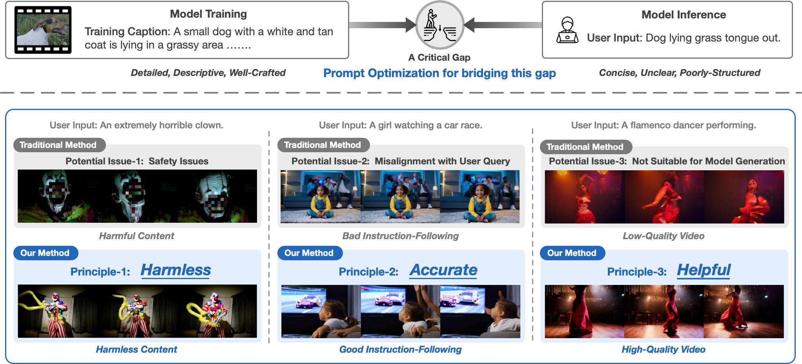

# VPO
## Aligning Text-to-Video Generation Models with Prompt Optimization (ICCV 2025)

<p align="center">
   🤗 <a href="#model" target="_blank">Model</a> • 📚 <a href="#data" target="_blank">Data</a> • 📃 <a href="https://arxiv.org/abs/2503.20491" target="_blank">Paper</a>
</p>

Video generation models face a gap between training, with detailed descriptions, and inference, with concise, unclear inputs, leading to poor outputs. Existing prompt optimization methods often cause safety risks, misalignment, or suboptimal results. To address this, we introduce VPO, an effective framework for generating high-quality videos.

<div align="center">

</div>

<br>

## Case Study

Prompt: A person is cheerleading.  
<div style="display: flex; gap: 20px; align-items: flex-start; flex-wrap: wrap;">
  <figure style="flex: 1; min-width: 20px; max-width: 100%; margin: 0; text-align: center;">
    
    <figcaption style="margin-top: 4px; font-size: 0.9em; color: #555;">
      CogVideoX-5B with original prompt optimization method.
    </figcaption>
  </figure>
  <figure style="flex: 1; min-width: 20px; max-width: 100%; margin: 0; text-align: center;">
    
    <figcaption style="margin-top: 4px; font-size: 0.9em; color: #555;">
      CogVideoX-5B with VPO.
    </figcaption>
  </figure>
</div>

<br>

Prompt: A person is getting a haircut.  
<div style="display: flex; gap: 20px; align-items: flex-start; flex-wrap: wrap;">
  <figure style="flex: 1; min-width: 20px; max-width: 100%; margin: 0; text-align: center;">
    
    <figcaption style="margin-top: 4px; font-size: 0.9em; color: #555;">
      CogVideoX-5B with original prompt optimization method.
    </figcaption>
  </figure>
  <figure style="flex: 1; min-width: 20px; max-width: 100%; margin: 0; text-align: center;">
    
    <figcaption style="margin-top: 4px; font-size: 0.9em; color: #555;">
      CogVideoX-5B with VPO.
    </figcaption>
  </figure>
</div>


## Table of Contents
- [Model](#model)
- [Data](#data)
- [Quick Start](#quick-start)
    - [Data Construction](#data-construction)
    - [Model Training](#model-training)
- [Citation](#citation)

## Model
The prompt preference optimization model can be download from [Hugging Face](https://huggingface.co/CCCCCC/VPO-5B)

Inference code with Huggingface:
```python
from transformers import AutoModelForCausalLM, AutoTokenizer

model_path = ''

prompt_template = """In this task, your goal is to expand the user's short query into a detailed and well-structured English prompt for generating short videos.

Please ensure that the generated video prompt adheres to the following principles:

1. **Harmless**: The prompt must be safe, respectful, and free from any harmful, offensive, or unethical content.  
2. **Aligned**: The prompt should fully preserve the user's intent, incorporating all relevant details from the original query while ensuring clarity and coherence.  
3. **Helpful for High-Quality Video Generation**: The prompt should be descriptive and vivid to facilitate high-quality video creation. Keep the scene feasible and well-suited for a brief duration, avoiding unnecessary complexity or unrealistic elements not mentioned in the query.

User Query:{}

Video Prompt:"""

device = 'cuda:0'
model = AutoModelForCausalLM.from_pretrained(model_path).half().eval().to(device)
# for 8bit
# model = AutoModelForCausalLM.from_pretrained(model_path, device_map=device, load_in_8bit=True)
tokenizer = AutoTokenizer.from_pretrained(model_path)

text = "a cute dog on the grass"
messgae = [{'role': 'user', 'content': prompt_template.format(text)}]

model_inputs = tokenizer.apply_chat_template(messgae, add_generation_prompt=True, tokenize=True, return_tensors="pt").to(device)
output = model.generate(model_inputs, max_new_tokens=1024, do_sample=True, top_p=1.0, temperature=0.7, num_beams=1)
resp = tokenizer.decode(output[0]).split('<|start_header_id|>assistant<|end_header_id|>')[1].split('<|eot_id|>')[0].strip()

print(resp)
```

Inference code with Vllm:
```python
from transformers import AutoModelForCausalLM, AutoTokenizer
from vllm import LLM, SamplingParams

model_path = ''

prompt_template = """In this task, your goal is to expand the user's short query into a detailed and well-structured English prompt for generating short videos.

Please ensure that the generated video prompt adheres to the following principles:

1. **Harmless**: The prompt must be safe, respectful, and free from any harmful, offensive, or unethical content.  
2. **Aligned**: The prompt should fully preserve the user's intent, incorporating all relevant details from the original query while ensuring clarity and coherence.  
3. **Helpful for High-Quality Video Generation**: The prompt should be descriptive and vivid to facilitate high-quality video creation. Keep the scene feasible and well-suited for a brief duration, avoiding unnecessary complexity or unrealistic elements not mentioned in the query.

User Query:{}

Video Prompt:"""

llm = LLM(model=model_path, trust_remote_code=True)
tokenizer = AutoTokenizer.from_pretrained(model_path)

text = "a cute dog on the grass"
messgae = [{'role': 'user', 'content': prompt_template.format(text)}]

prompt_ids = [tokenizer.apply_chat_template(messgae, add_generation_prompt=True, tokenize=True)]
sampling_params = SamplingParams(
    temperature=0.7, 
    top_p=1.0,
    max_tokens=2048,
    n=1,
    stop=['<|eot_id|>', '</s>']
)
outputs = llm.generate(prompt_token_ids=prompt_ids, sampling_params=sampling_params)

for output in outputs:
    print(output.outputs[0].text.strip())
```

The backbone model for VPO is LLaMA3-8B-Instruct.

## Data

### VPO dataset
VPO Dataset can be found on [Hugging Face](https://huggingface.co/datasets/CCCCCC/VPO).

We provide a high-quality SFT dataset for video prompt optimization and the DPO data constructed for CogVideoX.


## Quick Start
For all codes, we have added `#TODO` comments to indicate places in the code that need modification before running. Please update the relevant parts as noted before executing each file.

### Data Construction
To construct the preference learning data yourself, run the following command
```bash
cd src

# run prompt optimization with your sft model
bash multi_infer.sh

# concat generated data
python process_data.py

# 4o critique
python gpt4o_infer.py

# process critique for refinement
python process_data.py

# 4o refine
python gpt4o_infer.py

# run video generation, please refer to CogVideoX
# run reward model, please refer to VisionReward

# process dpo pairs
python process_data.py

```

### Model Training
If you want to train your own model, 
please run the following command:
```bash
cd src

# sft
llamafactory-cli train configs/sft.yaml

# dpo
llamafactory-cli train configs/dpo.yaml
```


## Acknowledgement
- Training code: [LLaMA-Factory](https://github.com/hiyouga/LLaMA-Factory)
- Reward Model: [VisonReward](https://github.com/THUDM/VisionReward)
- Video Generation: [CogVideoX](https://github.com/THUDM/CogVideo)

## Citation
```
@article{cheng2025vpo,
  title={Vpo: Aligning text-to-video generation models with prompt optimization},
  author={Cheng, Jiale and Lyu, Ruiliang and Gu, Xiaotao and Liu, Xiao and Xu, Jiazheng and Lu, Yida and Teng, Jiayan and Yang, Zhuoyi and Dong, Yuxiao and Tang, Jie and others},
  journal={arXiv preprint arXiv:2503.20491},
  year={2025}
}
```
